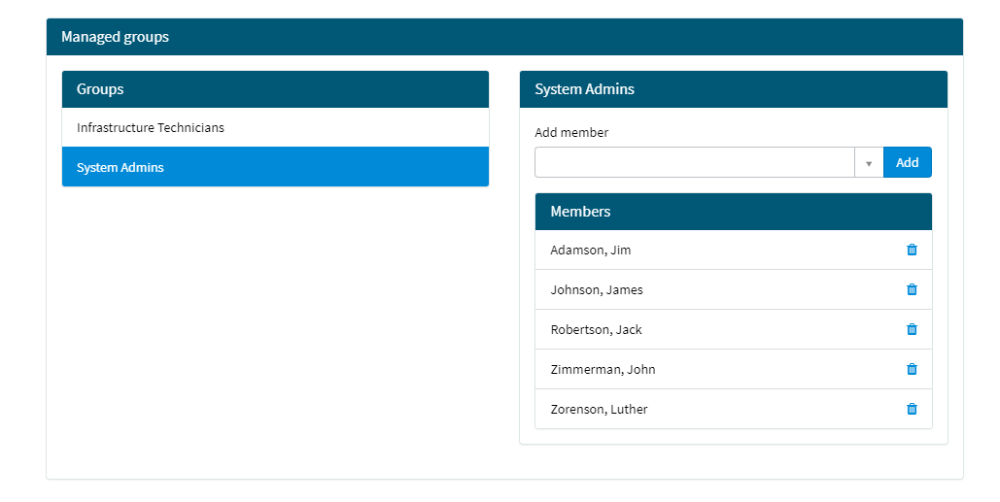

# Service Portal Widget - My Managed Groups

A widget for the Service Portal so the current user can manage members of the groups they own.

## Features

* List owned groups
* Add / Remove members from a group
* Filters out users already in the group
* Robust validation and feedback messages
* Uses GlideRecordSecure for queries

## Configuration

* Base user filter encoded query (default of 'active=true'; clear query with '^' in instance options)
* Bootstrap Color and Glyph
* Overridable title

## More

[Find on Share](https://developer.servicenow.com/connect.do#!/share/contents/5924274_service_portal_widget_my_managed_groups?t=PRODUCT_DETAILS)

[See more on GitHub](https://github.com/void-type/ServiceNowShare)
